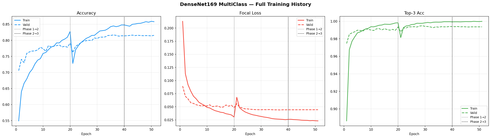
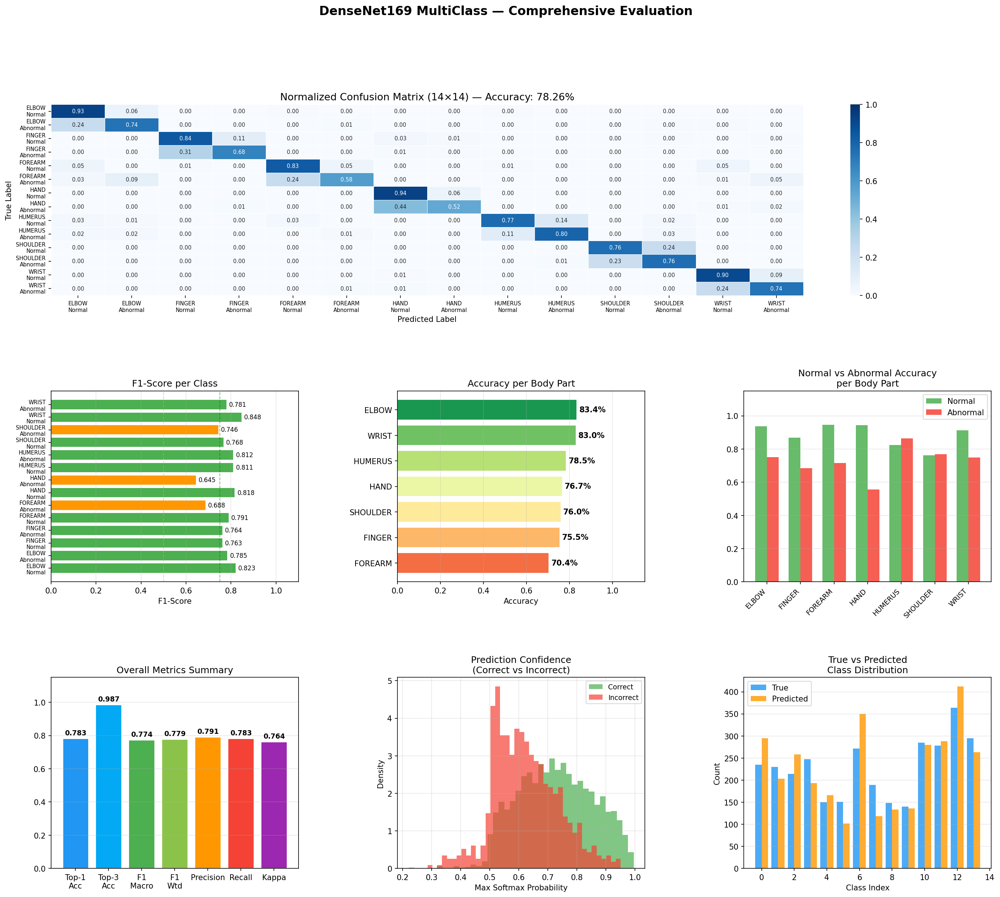
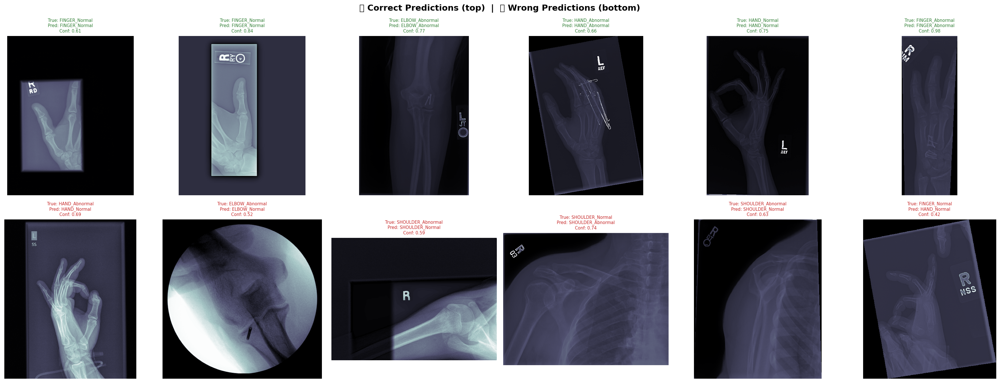
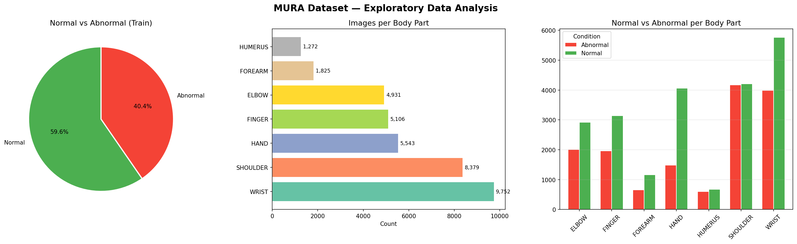
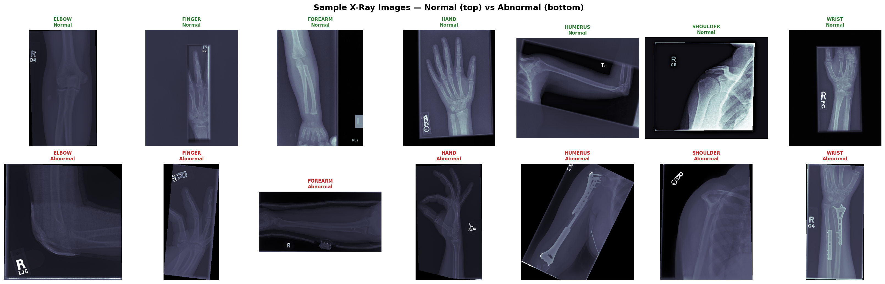

# 🦴 BONIFY — AI-Powered Fracture & Abnormality Detection

<div align="center">

[](https://python.org)
[](https://tensorflow.org)
[](https://keras.io)
[](https://streamlit.io)
[](LICENSE)
[](https://www.kaggle.com/datasets/cjinny/mura-v11)

<br>

**A deep learning system for automated bone fracture and abnormality detection**  
**from musculoskeletal X-ray images — 14-class classification across 7 body regions**

</div>

---

## 📋 Table of Contents

- [What We Built](#-what-we-built)
- [Project Workflow](#-project-workflow)
- [Results](#-results)
- [Dataset](#-dataset)
- [Model Architecture](#-model-architecture)
- [Training Strategy](#-training-strategy)
- [BONIFY App — Deployment](#bonify-app--deployment)
- [Project Structure](#-project-structure)
- [References](#-references)

---

## 🎯 What We Built

BONIFY is an end-to-end deep learning pipeline for **musculoskeletal X-ray classification**. The system goes beyond simple binary fracture detection — it simultaneously **identifies the body region** and **determines whether it is normal or abnormal**, classifying each X-ray into one of **14 distinct classes**.

The project covers the full ML lifecycle:

- 📂 **Data loading and preprocessing** — built a robust `tf.data` pipeline with augmentation
- 🔍 **Exploratory data analysis** — visualized class distributions, imbalances, and sample images
- 🧠 **Model design** — built a custom head on top of DenseNet169 with focal loss for imbalanced classes
- 🚀 **3-phase training** — progressive transfer learning from frozen base to full fine-tuning
- 📊 **Comprehensive evaluation** — confusion matrix, F1, Cohen's Kappa, Top-3 accuracy, per-class analysis
- 🖥️ **Streamlit deployment** — a clean web app (BONIFY) for real-time X-ray inference

| Property | Value |
|----------|-------|
| **Task** | Multi-Class Classification — 14 classes |
| **Model** | DenseNet169 — Pretrained on ImageNet |
| **Training** | 3-Phase Transfer Learning + Fine-Tuning |
| **Loss** | Categorical Focal Loss (γ=2.0, α=0.25) |
| **Dataset** | MURA v1.1 — Stanford ML Group |
| **Image Size** | 320 × 320 px |
| **Framework** | TensorFlow / Keras |
| **Deployment** | Streamlit Web App |

---

## 🔄 Project Workflow

```
Raw MURA Dataset
      │
      ▼
 Data Loading & Preprocessing
 ├── glob scan of PNG files
 ├── Extracted body part from folder name (XR_*)
 ├── Extracted label from path (positive/negative)
 └── Built train / val / test DataFrames
      │
      ▼
 Exploratory Data Analysis
 ├── Class distribution (Normal vs Abnormal)
 ├── Images per body part
 └── Sample X-rays — Normal vs Abnormal
      │
      ▼
 tf.data Pipeline
 ├── Image resize → 320×320
 ├── Normalization → [0.0, 1.0]
 ├── Augmentation (train only):
 │     flip · brightness · contrast · saturation · crop
 └── Class weights for imbalance
      │
      ▼
 DenseNet169 + Custom Head
 ├── Phase 1 — Transfer Learning  (LR: 1e-4, frozen base)
 ├── Phase 2 — Fine-Tuning        (LR: 5e-6, all layers)
 └── Phase 3 — Deep Fine-Tuning   (LR: 1e-6, all layers)
      │
      ▼
 Evaluation
 ├── Confusion Matrix (14×14)
 ├── F1, Kappa, Precision, Recall
 ├── Per-class accuracy
 └── Correct vs Wrong predictions
      │
      ▼
 BONIFY Streamlit App
 └── Upload X-ray → Body part + Normal/Abnormal + Confidence
```

---

## 📊 Results

### Overall Metrics — Test Set (3,197 images)

| Metric | Score |
|--------|-------|
| **Top-1 Accuracy** | **78.26%** |
| **Top-3 Accuracy** | **98.65%** |
| **Cohen's Kappa** | **0.7641** |
| **F1 Score (Macro)** | **0.7744** |
| **F1 Score (Weighted)** | **0.7791** |

> Top-3 accuracy of **98.65%** means the correct class appears in the model's top 3 predictions for almost every image — clinically very useful for shortlisting.

### Accuracy by Body Region

| Region | Accuracy | Test Samples |
|--------|----------|-------------|
| 🦾 Elbow | **83.4%** | 465 |
| ⌚ Wrist | **83.0%** | 659 |
| 🦴 Humerus | **78.5%** | 288 |
| ✋ Hand | **76.7%** | 460 |
| 🩻 Shoulder | **76.0%** | 563 |
| ☝️ Finger | **75.5%** | 461 |
| 💪 Forearm | **70.4%** | 301 |

### Top Confused Class Pairs

| Predicted As | True Class | Count |
|---|---|---|
| HAND_Normal | HAND_Abnormal | 83 |
| FINGER_Normal | FINGER_Abnormal | 76 |
| WRIST_Normal | WRIST_Abnormal | 71 |

> Most confusion is Normal↔Abnormal within the same region — the model correctly identifies body parts but occasionally misses subtle pathology.

### Training Curves



The 3-phase strategy is clearly visible — each phase transition causes a brief dip then recovery as the learning rate resets and more layers unfreeze.

### Evaluation Results



### Correct vs Wrong Predictions



---

## 📦 Dataset

**MURA v1.1 — Musculoskeletal Radiographs**  
Stanford ML Group · [Kaggle Dataset](https://www.kaggle.com/datasets/cjinny/mura-v11)

MURA is one of the largest publicly available musculoskeletal radiology datasets, containing X-ray studies of 7 upper extremity body parts labeled as normal or abnormal by board-certified radiologists.

| Split | Images |
|-------|--------|
| Train (85%) | ~36,808 |
| Validation (15% stratified) | ~6,496 |
| Test (MURA valid folder) | 3,197 |

### Class Mapping — 14 Classes

| Label | Class | Label | Class |
|-------|-------|-------|-------|
| 0 | ELBOW_Normal | 1 | ELBOW_Abnormal |
| 2 | FINGER_Normal | 3 | FINGER_Abnormal |
| 4 | FOREARM_Normal | 5 | FOREARM_Abnormal |
| 6 | HAND_Normal | 7 | HAND_Abnormal |
| 8 | HUMERUS_Normal | 9 | HUMERUS_Abnormal |
| 10 | SHOULDER_Normal | 11 | SHOULDER_Abnormal |
| 12 | WRIST_Normal | 13 | WRIST_Abnormal |

### Exploratory Data Analysis



Key observations:
- **59.6%** Normal / **40.4%** Abnormal — mild class imbalance addressed with `compute_class_weight(balanced)`
- WRIST (9,752) and SHOULDER (8,379) dominate the training distribution
- HUMERUS (1,272) and FOREARM (1,825) are underrepresented — handled by class weighting

### Sample X-Ray Images — Normal vs Abnormal



---

## 🧠 Model Architecture

We chose **DenseNet169** for its dense connectivity pattern — each layer receives feature maps from all preceding layers, making it highly effective for medical imaging where subtle patterns matter.

```
Input (320×320×3)
    └── DenseNet169 (pretrained ImageNet weights)
        └── GlobalAveragePooling2D
            └── BatchNormalization
                └── Dense(512, activation='relu')
                    └── Dropout(0.4)
                        └── Dense(14, activation='softmax')
```

### Why Focal Loss?

Standard cross-entropy treats all examples equally. With MURA's class imbalance and the inherent difficulty of subtle fractures, we used **Categorical Focal Loss** which:
- Down-weights easy examples the model already classifies correctly
- Forces the model to focus on hard, ambiguous cases
- Significantly improves performance on minority classes

```python
def categorical_focal_loss(gamma=2.0, alpha=0.25):
    def focal_loss(y_true, y_pred):
        y_pred = tf.clip_by_value(y_pred, K.epsilon(), 1.0 - K.epsilon())
        ce     = -y_true * tf.math.log(y_pred)
        weight = alpha * y_true * tf.pow(1.0 - y_pred, gamma)
        return tf.reduce_mean(tf.reduce_sum(weight * ce, axis=-1))
    return focal_loss
```

---

## 🚀 Training Strategy

Rather than training all layers from scratch or fine-tuning everything at once, we used a **3-phase progressive strategy** to maximize stability and performance:

### Phase 1 — Transfer Learning
The DenseNet169 base is frozen. Only the custom classification head is trained. This lets the head learn to map DenseNet features to our 14 classes without corrupting the pretrained weights.

```
LR: 1e-4  |  Epochs: 10  |  Base: frozen  |  Head: trainable
```

### Phase 2 — Fine-Tuning
All layers are unfrozen at a much lower learning rate. The entire network adapts together to the medical imaging domain.

```
LR: 5e-6  |  Epochs: 20  |  All layers: trainable  |  Augmentation: ON
```

### Phase 3 — Deep Fine-Tuning
Final refinement pass at an even lower learning rate with class weights applied to push performance on underrepresented classes.

```
LR: 1e-6  |  Epochs: 15  |  Class weights: ON
```

**Callbacks used throughout:**
- `EarlyStopping` — patience=5, monitors `val_loss`
- `ReduceLROnPlateau` — factor=0.5, patience=3
- `ModelCheckpoint` — saves best model per phase

**Data augmentation (training only):**
Random horizontal flip · Random vertical flip · Random brightness ±15% · Random contrast [0.85–1.15] · Random saturation [0.85–1.15] · Random crop/pad

---

## BONIFY App — Deployment

---

### 🖥️ BONIFY App — Live Demo Screenshots

The BONIFY Streamlit interface provides a clean clinical-style dashboard for real-time inference.

### 🔹 Upload & Prediction Interface


### 🔹 Prediction Output & Confidence Scores


---

## 🎥 Project Demo Video

Watch the full walkthrough and deployment demo on LinkedIn:

🔗 **Project Video:**  
https://www.linkedin.com/posts/morad-elnahla_deeplearning-medicalimaging-computervision-ugcPost-7432905481653866496-j2TK
---

## 📁 Project Structure

```
MURA-multiclass-xray-classifier/
│
├── all_files,Report,EDA/
│   ├── app.py                      # BONIFY Streamlit app
│   ├── mura-multi-class.ipynb      # Full training & evaluation notebook
│   ├── test_predictions.csv        # Complete test set predictions
│   ├── test_probs.npy              # Softmax probabilities  (3197 × 14)
│   ├── test_preds.npy              # Predicted class indices (3197,)
│   ├── true_labels.npy             # Ground truth labels     (3197,)
│   ├── eda_overview.png            # EDA visualizations
│   ├── training_curves.png         # 3-phase training history
│   ├── evaluation_results.png      # Confusion matrix + metrics
│   ├── sample_images.png           # Sample X-rays per class
│   └── correct_vs_wrong.png        # Prediction examples
│
├── Data/                           # Dataset documentation (PDF)
├── Documentation/                  # Full model documentation (DOCX)
├── Refrences/                      # References & citations (PDF)
├── code/                           # Additional scripts
└── README.md
```

> **Note:** The trained model file `densenet169_multiclass_final.keras` (~157 MB) is not included in the repository due to size constraints. It can be reproduced by running `mura-multi-class.ipynb` on Kaggle with the MURA v1.1 dataset.

---

## 📚 References

1. Rajpurkar, P. et al. (2018). MURA: Large Dataset for Abnormality Detection in Musculoskeletal Radiographs. *arXiv:1712.06957*
2. Huang, G. et al. (2017). Densely Connected Convolutional Networks (DenseNet). *CVPR 2017*
3. Lin, T.Y. et al. (2017). Focal Loss for Dense Object Detection. *ICCV 2017*
4. Standring, S. (2020). Gray's Anatomy: The Anatomical Basis of Clinical Practice. *42nd Edition, Elsevier*

Full references and citations available in [`Refrences/`](Refrences/)

---

> ⚠️ **Disclaimer:** This project is for **research and educational purposes only**. BONIFY is not a medical device and should not be used for clinical diagnosis. Always consult a qualified medical professional for radiological interpretation.

<div align="center">
<br>

Made with ❤️ &nbsp;·&nbsp; BONIFY v1.0 &nbsp;·&nbsp; 2025

</div>
